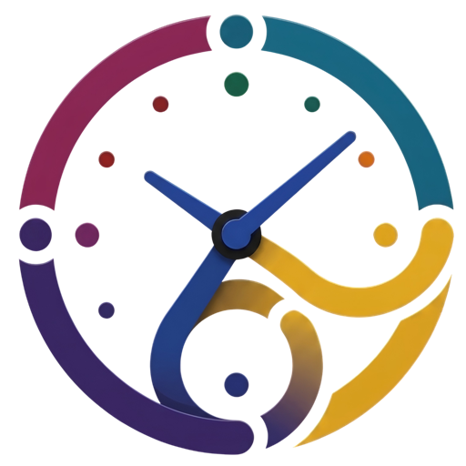

<p align="center">
  
</p>

## TokenTime

**Know when your next window opens — at a glance.**
A macOS menu bar app that tracks when your Claude usage windows reset, across as
many accounts and as many Macs as you use.

[](https://developer.apple.com/xcode/)
[](https://www.apple.com/macos)
[](LICENSE)

Click the menu bar icon and you get every account with a live countdown. The label
in the menu bar always shows the one resetting soonest, so a glance is enough.

> The interface is in Polish.

---

## Why

If you work across several Claude accounts, the only thing you actually need to
know is *when does the next window open again*. That answer normally lives in your
head or in a note somewhere. TokenTime puts it in the menu bar and keeps it there.

## Features

### Accounts and countdowns

- **Any number of accounts**, each with an editable name (double-click or the
  pencil icon).
- **Set a reset with one text field.** Type a clock duration — `3:30` is three
  and a half hours, `0:45` is forty-five minutes — or a bare number of hours, so
  `4` means four hours. Nothing else is accepted: `4h` and `90m` are rejected.
  The popover previews the resulting clock time and refuses anything it can't
  parse.
- **Native countdowns** via `Text(timerInterval:)`, so the numbers tick without a
  timer of our own running behind the window.
- **Status at a glance**, mirrored by both the card colour and its progress bar:
  - **blue** — running, more than an hour left
  - **amber** — running, under an hour
  - **green** — the window has reset and is ready to use again
- **Reset** clears the counter and immediately opens the field for the next one.
- **Progress bar** spanning exactly the duration you entered, so it always starts
  empty and reaches the end at the reset. (There is no separate window-length
  setting — the field you type into *is* the window.)

### Across your Macs

- **Which computer is this account logged in on?** Each account carries toggles
  for your machines — Mac mini, iMac, MacBook, Mac Studio — so you can see at a
  glance where a profile is currently signed in. Pick which of the four you
  actually own in Settings and only those appear.
- **Sync via iCloud Drive.** Accounts live in
  `~/Library/Mobile Documents/com~apple~CloudDocs/TokenTime/accounts.json`, polled
  every seven seconds, so a reset you set on one Mac shows up on the others.
  Changes arriving from another machine don't bounce back out as a new write.
  Reads and writes go through `NSFileCoordinator`, because the file is swapped
  underneath us by the iCloud daemon.
- **Merged per account, not per file.** Every account carries the time it last
  changed, and syncing picks the newer version of each account separately. Two
  Macs editing two different accounts inside the same polling window both keep
  their edit. Deletions leave a tombstone for thirty days so a deleted account
  doesn't come back from another Mac's copy.
- **Nothing is written until the cloud state is known.** If the file exists in
  iCloud but hasn't been downloaded to this Mac yet, the panel says so and stays
  read-only rather than showing an empty list you could overwrite the cloud with.
  If the download stalls, an explicit button lets you carry on locally — and even
  then the cloud file is left alone until it arrives.
- **Visible sync state.** A small badge next to the app name says whether the last
  exchange worked, and why not if it didn't.
- **Local fallback** — if iCloud Drive isn't available the accounts are kept in
  `UserDefaults`, and nothing is lost.

### Menu bar behaviour

- The label shows the **shortest active countdown**, refreshed every 30 seconds by
  a lightweight task (`Text(timerInterval:)` doesn't animate inside a
  `MenuBarExtra` label).
- Separate light and dark icon variants.
- **No Dock icon** — the app runs as an accessory (`setActivationPolicy(.accessory)`),
  so it stays out of ⌘-Tab and the Dock without any `Info.plist` surgery.
- **Launch at login**, via `SMAppService`.

---

## Privacy

TokenTime makes **no network connections** and talks to no API — not Anthropic's,
not anyone's. It knows nothing about your accounts beyond the names you type and
the times you enter. There is no telemetry and no analytics. The only thing that
leaves your Mac is the accounts file, and only into your own iCloud Drive.

## Requirements

- macOS 26 or later
- Xcode 26 or later to build

## Building

```bash
git clone https://github.com/mikagosz/TokenTime.git
cd TokenTime
open TokenTime.xcodeproj
```

Then press ⌘R.

The project pins a local code-signing identity that won't be in your keychain. Set
**Signing & Capabilities → Signing Certificate** to *Sign to Run Locally*, or point
it at your own.

The app is deliberately **not sandboxed**: reaching the iCloud Drive folder
directly is what lets it sync without a paid Apple Developer account. That also
means it isn't headed for the App Store.

## Project layout

| File | Role |
|---|---|
| `ContentView.swift` | `@main` app with `MenuBarExtra` and the `AppDelegate` |
| `Account.swift` | account model, change stamp, reset status, computer list |
| `AccountStore.swift` | state, merging, debounced saving, menu bar summary |
| `AccountsFile.swift` | coordinated reads and writes of the iCloud Drive file |
| `MenuBarView.swift` | the main panel |
| `AccountCardView.swift` | a single account card, plus the duration parser |
| `MenuBarLabel.swift` | the menu bar label |
| `SettingsView.swift` | which computers you own |
| `LaunchAtLogin.swift` | login item registration |
| `Log.swift` | `os.Logger` categories |

Tests live in `Tests/` and cover the pure parts: the duration parser, account
status and progress, the menu bar summary, and the merge rules.

```bash
xcodebuild -project TokenTime.xcodeproj -scheme TokenTime test
```

## Licence

The **source code** is MIT — see [LICENSE](LICENSE).

The **artwork is not**: the app icon (`App/tokentime.icon/`), the menu bar icons
(`App/Assets.xcassets/MenuBarIcon.imageset/`) and `docs/assets/tokentime-icon.png` are
Copyright (c) 2026 mikagosz, all rights reserved, and are excluded from the MIT grant —
see [NOTICE](NOTICE). If you fork this project, replace them with your own.
